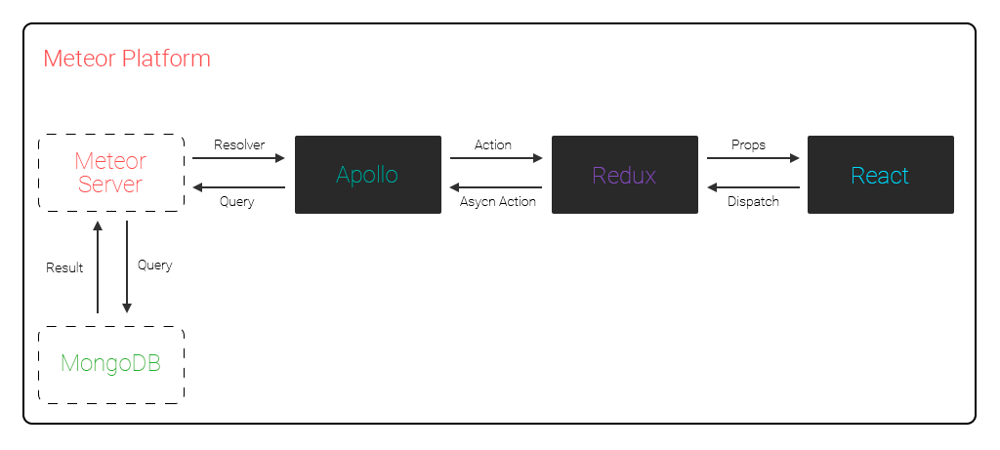

# mars

* [**M**eteor](https://www.meteor.com/)
* [**A**pollo](http://www.apollodata.com/)
* [**R**edux](http://redux.js.org/)
* [**R**eact](https://facebook.github.io/react/)

The folder structure is pretty messy, this is a proof of concept not a skeleton.
